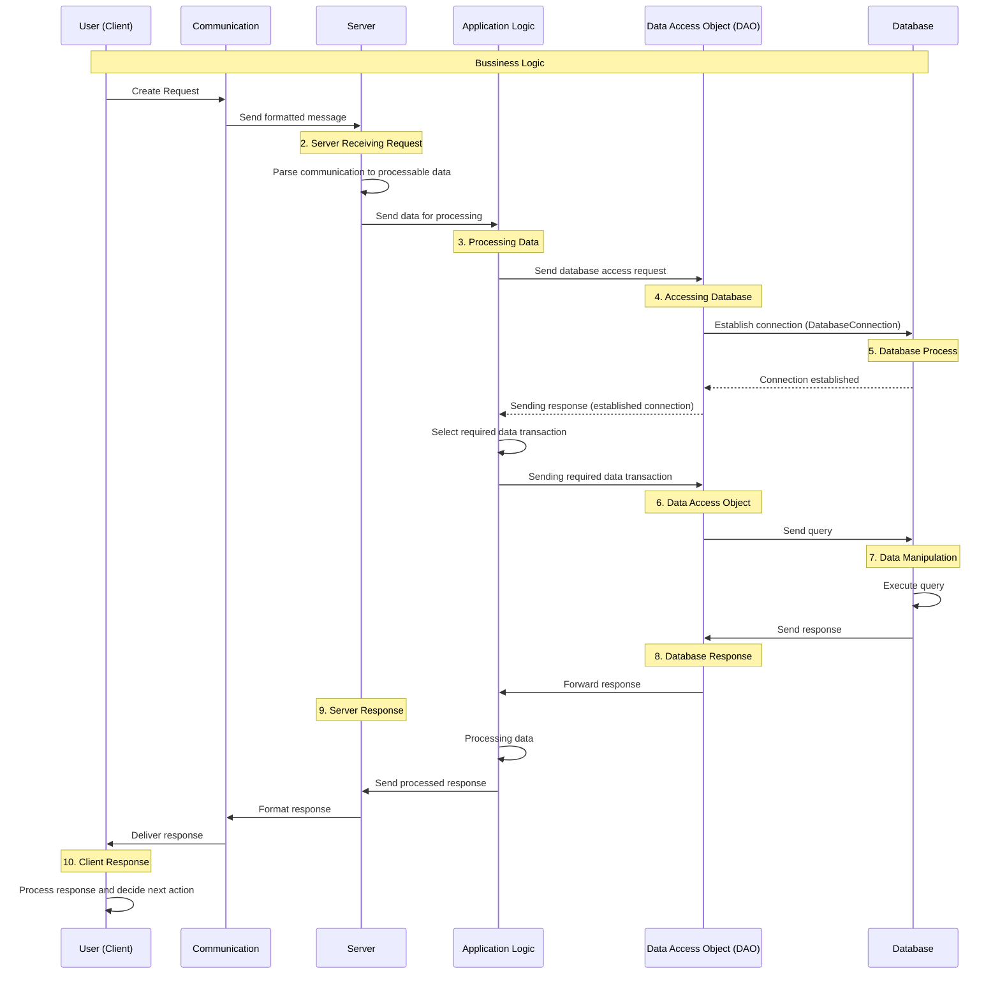

# Bussiness Logic - Ticket Marketplace

1. Client Request
User (Client) Create Request -> Communication (Create communication message for consistent protocols) -> Server receiving request

2. Server Receiving Request from Client
Server receiving request -> Parsing communication to processable data -> sending data to process

3. Processing Data
Server sending data -> app logic -> send request to access database -> accessing database

4. Accessing Database
Accessing Database -> Requesting DAO (Data Access Object) to communicate with Database -> Connected to Database (DatabaseConnection - similar to MyModel)

5. Database Process
Connected to Database -> selecting function that required for business logic (Choosing command) -> DAO Runs the command

6. Data Access Object
DAO Runs the command -> Sending Query to Database -> Database receiving query

7. Data Manipulation in Database
Database receiving query -> Database running query -> Database sending response

8. Database Response
Database sending response -> DAO receving response -> DAO sending response to business logic

9. Server Response
DAO sending response to business logic -> Server receiving response -> Server doing business logic (if needed) -> Server sending response 

10. Client Response 
Server sending response - client receiving response -> client create request (depending on user)

## Diagram
